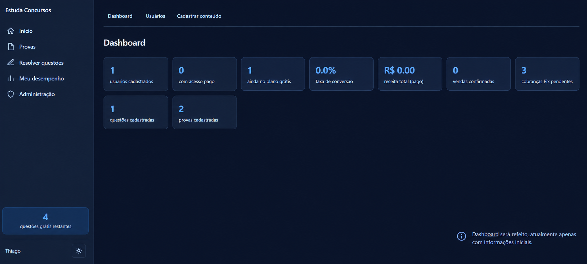
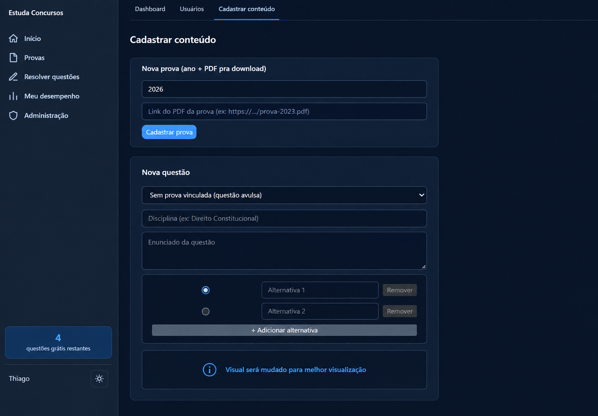
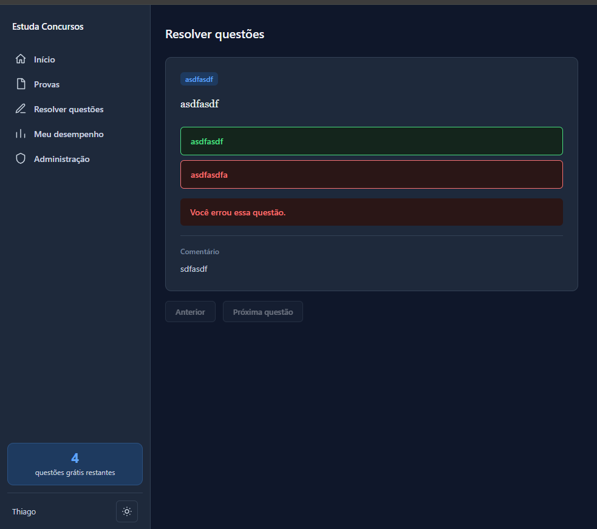

# Estuda TJPI

Plataforma full-stack desenvolvida para gerenciamento de provas, questões e controle de acesso a conteúdos preparatórios para concursos públicos. O sistema conta com painel administrativo modernizado, controle de limites freemium e integração robusta com banco de dados relacional.

---

## 🛠️ Tecnologias Utilizadas

* **Backend:** NestJS, TypeScript, Node.js
* **Frontend:** Next.js, React, Tailwind CSS
* **Banco de Dados:** PostgreSQL
* **ORM:** Prisma ORM (v5.22)

---

## 🚀 Principais Funcionalidades

* **Gestão de Provas (Exams):**
  * Cadastro simplificado e download disponível de todas as provas passadas.
  * Validações e fallbacks no backend para prevenção de erros de runtime e envio de campos obrigatórios.

* **Gestão de Questões (Questions):**
  * Interface com cards expansíveis para alteração dinâmica de alternativas e marcação de gabarito correto.
  * Suporte a imagens no enunciado e anexação de explicações/comentários detalhados.

* **Regras de Negócio e Controle de Acesso:**
  * **Limite Freemium:** Mecanismo automático (`FreeQuestionAccess`) para controle do limite gratuito de visualização de até 5 questões/explicações por usuário antes de exigir plano pago.
  * **Tratamento de Dados:** Resiliência contra payloads incompletos no painel de administração para manter a disponibilidade da API.

---

## 📁 Estrutura do Projeto

```text
concursos-app/
├── backend/                  # API NestJS + Prisma ORM
│   ├── prisma/
│   │   └── schema.prisma     # Modelos do banco de dados (Exam, Question, User, etc.)
│   └── src/
│       ├── admin/            # Serviços de administração de provas e questões
│       ├── questions/        # Regras de negócio, estatísticas e controle freemium
│       └── prisma/           # Módulo de conexão com o PostgreSQL
└── frontend/                 # Aplicação Next.js
    └── src/                  # Formulários administrativos e interface de estudos
```

---

## 🚧 Status do Projeto

> ⚠️ **Projeto em Desenvolvimento:** Esta plataforma encontra-se atualmente em fase de construção e evolução contínua. Novas funcionalidades, otimizações de performance, refatorações no painel administrativo e ampliação da cobertura de testes estão sendo implementadas ativamente.

---

## 📸 Galeria e Demonstração do Sistema

Abaixo estão os espaços reservados para a adição de imagens e capturas de tela do sistema em funcionamento:

### Painel Administrativo
| Dashboard & Estatísticas | Formulário de Cadastro (Provas e Questões) |
| :---: | :---: |
|  |  |

### Interface do Usuário / Estudo
| Resolução de Questões | Visualizador de Provas em PDF |
| :---: | :---: |
|  |  |
